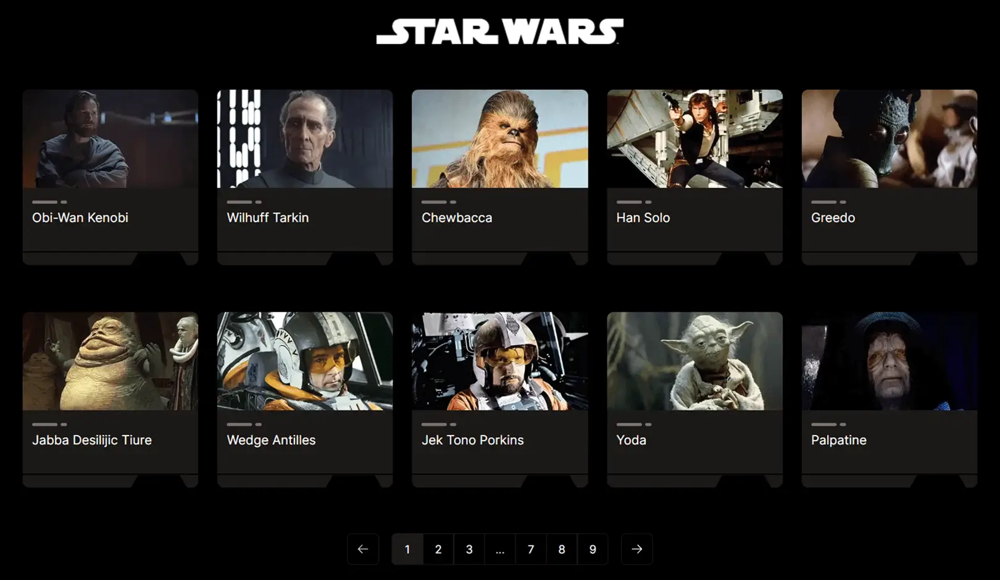

# Star Wars Characters

The goal of the assignment is to create a web application that will allow users to view a list of Star Wars characters, as well as detailed information about the spaceships and movies associated with each character, using NextJS for the application structure and React Flow to visualize the information in the form of a graph.

# [LIVE DEMO](https://star-wars-lime-chi.vercel.app/)

# Technologies used

<ul>
  <li>Next</li>
  <li>React Flow</li>
  <li>TypeScript</li>
  <li>Tailwind</li>  
  <li>Axios</li>
  <li>Vitest</li>
  <li>Vercel</li>
</ul>

# Preview

# How to run the project locally

- Fork and clone this repository
- Run `npm install` in your terminal
- Run `npm run dev` in your terminal to start the project locally
- Open [http://localhost:3000](http://localhost:3000) with your browser to see the result.
- Run `npm test` in your terminal to start test

# Deploy on Vercel

The easiest way to deploy your Next.js app is to use the [Vercel Platform](https://vercel.com/new?utm_medium=default-template&filter=next.js&utm_source=create-next-app&utm_campaign=create-next-app-readme) from the creators of Next.js.

Check out [Next.js deployment documentation](https://nextjs.org/docs/deployment) for more details.
